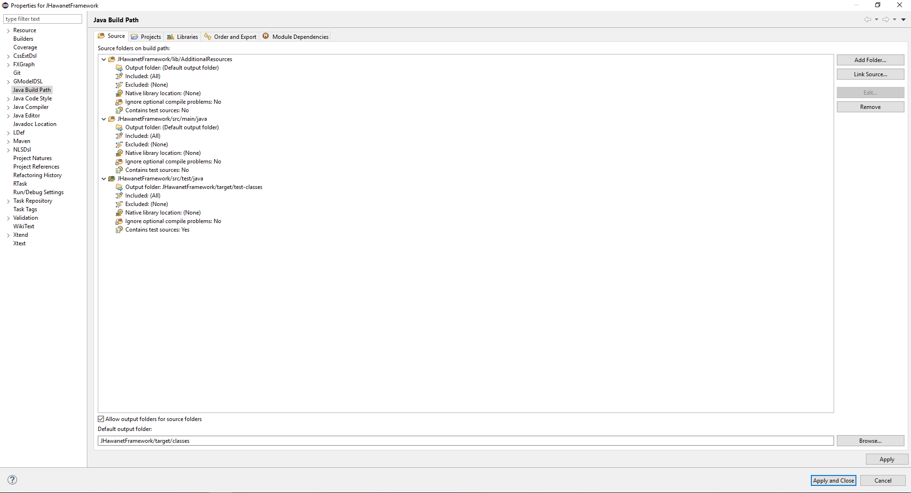

# JHawanetFramework

Este software permite la solución de problemas relacionados a redes de distribución de agua potable. Los problemas que el programa incluye por defecto son
+ El problema monoobjetivo de costo de inversion
+ El problema multiobjetivo de de regimen de bombeo, cuyos objetivos son el costo energetico y el costo de mantenimiento.

## Como instalar

Los pasos para instalar el software son los siguientes:

1. Instalar maven. Una guia de como instalarlo puede encontrarla [aquí](hhttps://maven.apache.org/index.html)
2. Una vez maven este instalado, hay que agregar el jar de la EpanetTolkit requerido para la simulación al repositorio de maven. Para esto ejecute el siguiente comando: 

```
mvn install:install-file -Dfile="lib/epajava.jar" -DgroupId=epajava -DartifactId=epajava -Dversion="1.0" -Dpackaging=jar
```
3. Ahora ejecute el comando:
```
mvn clean package
``` 
4. Despues de terminar la ejecución del comando el lanzador se encontrara en target/jfx/

5. Para volver a compilar solo hace falta ejecutar nuevamente el paso 3.

**NOTA**: Para poder ejecutar desde un IDE que permita proyectos maven se necesita haber realizado hasta el paso 2.

## Otras maneras de compilar
Compile with mvn jfx:jar to create a jar -> este comando realizaria lo mismo que mvn package

Compile with mvn jfx:native to create a native -> genera un exe y si estan instalados los programas correctos tambien generaria un instalador.

## Abrir proyecto con eclipse

Abrir el proyecto desde eclipse y asegurarse de que el build path este de la siguiente manera:



### Nota1: Assets es solo una carpeta donde se suben las imagenes. No es usada por el proyecto.
### Nota2: La version en ingles y la version en español de epanet a veces ocupan distintas palabras claves (Ej: Feet en ingles y Pies en español). Este programa lee el formato inp de la version en ingles.
