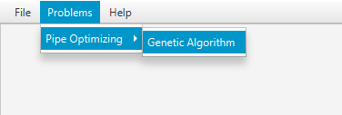

=== Anotaciones de la aplicación

==== Anotacion permitida en la clases _Operator_

===== _@DefaultConstructor_

Esta anotación indica el constructor principal utilizado para crear el operador a través de la interfaz gráfica.

Los elementos en esta anotación son los siguientes:

* _value_: Arreglo que recibe anotaciones del tipo _@NumberInput_.

==== Anotaciones pemitidas en la clases _Registrable_

===== _@NewProblem_
Esta anotación permite indicar el nombre del problema que será mostrado en la interfaz gráfica. Puedes ver el uso de esta anotación a continuación:

[[ejemplo-anotaciones]]
[source,java]
----
@NewProblem(displayName = "Pipe optimizing", algorithmName = "Genetic Algorithm", description = "The objective of this " +
    "problem is to optimize the cost of construction of the network by " +
    "varying the diameter of the pipe in order to ensure a minimum level of pressure."
)
@Parameters(operators = {
    @OperatorInput(displayName = "Selection Operator", value = {
            @OperatorOption(displayName = "Uniform Selection", value = UniformSelection.class)
    }),
    @OperatorInput(displayName = "Crossover Operator", value = {
            @OperatorOption(displayName = "Integer Single Point Crossover", value = IntegerSinglePointCrossover.class),
            @OperatorOption(displayName = "Integer SBX Crossover", value = IntegerSBXCrossover.class)
    }), //
    @OperatorInput(displayName = "Mutation Operator", value = {
            @OperatorOption(displayName = "Integer Simple Random Mutation", value = IntegerSimpleRandomMutation.class),
            @OperatorOption(displayName = "Integer Polynomial Mutation", value = IntegerPolynomialMutation.class),
            @OperatorOption(displayName = "Integer Range Random Mutation", value = IntegerRangeRandomMutation.class)
    })}, //
    files = {@FileInput(displayName = "Gama *")}, //
    numbers = {@NumberInput(displayName = "Independent run", defaultValue = 5),
            @NumberInput(displayName = "Min pressure", defaultValue = 30),
            @NumberInput(displayName = "Population Size", defaultValue = 100)}, //
    numbersToggle = {
            @NumberToggleInput(groupID = "Finish Condition", displayName = "Max number of evaluation", defaultValue = 25000),
            @NumberToggleInput(groupID = "Finish Condition", displayName = "Number of iteration without improvement", defaultValue = 100)
    }
)
public PipeOptimizingRegister(Object selectionOperator, Object crossoverOperator, Object mutationOperator, File gama, int independentRun,
                                int minPressure, int populationSize, int maxEvaluations, int numberWithoutImprovement) throws Exception {
    //code
}
----

Los elementos en esta anotación consisten en:

* _displayName_: El nombre del problema. Este nombre también actúa como el nombre de la categoría.
* _algorithm_: Un _String_ con el nombre del algoritmo usado para resolver el problema.
* _description_: Un _String_ con la descripción del algoritmo.

El nombre dado en el elemento _displayName_, es el nombre visible del problema en el menú de la aplicación y permite agrupar a los problemas que tengan el mismo nombre, pero distintos algoritmos, como se ve en la siguiente imagen.

Esta anotación solo puede estar en un constructor, *en caso de que esta anotación no esté presente, un error en tiempo de ejecución será lanzado*. 

===== _@Parameters_

Esta anotación permite agregar información acerca de los parámetros recibidos por el constructor. *Cuando el constructor tiene esta anotación, por convención, está obligado a declarar los parámetros en un orden determinado en base a tu tipo*. Este orden es el siguiente:

1. _Object_
2. _File_
3. _Enum_
4. _boolean_
5. _int_ o _double_

Si el constructor no declara los parámetros en ese orden un error en tiempo de ejecución será lanzado.

Dentro de esta anotación existen varios elementos. Estos elementos son:

* _operators_: Arreglo que recibe anotaciones del tipo _OperatorInput_. 
* _files_: Arreglo que recibe anotaciones del tipo _FileInput_.
* _enums_: Arreglo que recibe anotaciones del tipo _EnumInput_.
* _booleans_: Arreglo que recibe anotaciones del tipo _BooleanInput_.
* _numbers_:  Arreglo que recibe anotaciones del tipo _NumberInput_.
* _numbersToggle_: Arreglo que recibe anotaciones del tipo _NumberToggleInput_.

NOTE: Los valores de las anotaciones son inyectados en el constructor de la clase en el orden de la lista de elementos definidas anteriormente. Es decir, _operators_ (inyectados como _Object_), _files_ (_File_), _enums_ (inyectados en como un enumerador), _booleans_ (inyectados como boolean) ,_numbers_ (_int_ o _double_) y _numbersToggle_(_int_ o _double_).

El valor por defecto para todos los elementos mencionados anteriormente es un arreglo vacío ({}).
No usar la anotación _@Parameters_ tiene el mismo efecto que usar la anotación, pero con sus valores por defecto.

Puede ver el uso de esta anotación en el <<ejemplo-anotaciones, ejemplo anterior>>. 

===== _@OperatorInput_

Esta anotación agrega información a uno de los parámetros del constructor acerca de los posibles operadores que pueden ser recibidos por ese parámetro. 
Dentro de esta anotación existen varios elementos. Estos elementos son:

* _displayName_: Nombre de categoría para los operadores.
* _value_: Arreglo que recibe anotaciones del tipo _OperatorOption_.

En la ventana de configuración de problema, estos parámetros son vistos con un _ComboBox_ como muestra la siguiente imagen. 

image::images/anotaciones/ComponenteOperatorInput.png[]

Las alternativas disponibles dentro del _ComboBox_ están dadas por aquellas indicadas en el elemento value de este operador. Como se muestrará en la siguiente figura la única alternativa para el _Selection Operator_ es el operador _UniformSelection_.
 
image::images/anotaciones/ComponenteOperatorInputExpandido.png[]

Por defecto, el _ComboBox_ selecciona el primer elemento de la lista.
El botón _Configure_ permite configurar los parámetros que recibe el constructor del operador, aquel que posee la anotación _@DefaultConstructor_. Para el caso del operador _UniformSelection_, su interfaz es la siguiente:

image::images/nuevos_operadores/InterfazConfiguracionUniformSelection.png[]

===== _@OperatorOption_

Esta anotación permite indicar las alternativas de operadores que puede recibir un parámetro para una categoría de operador indicada por la anotación _@OperatorInput_.
Dentro de esta anotación existen varios elementos. Estos elementos son:

* _displayName_: Nombre del operador. Este es el nombre visualizado en el _ComboBox_.
* _value_: Instancia del tipo _Class_ que referencia el tipo de operador.

===== _@FileInput_

Esta anotación indica que hay un parámetro que espera recibir un objeto de tipo _File_. Cuando esta anotación está presente junto con su parámetro, en la interfaz, aparecerá un apartado que abre un _FileChooser_ o un _DirectoryChooser_ para buscar un archivo o directorio, respectivamente.
Dentro de esta anotación existen varios elementos. Éstos son:

* _displayName_: Nombre del parámetro. Este nombre también corresponde al nombre visualizado en la ventana de configuración como se muestra a continuación.
  
image::images/anotaciones/ComponenteFileInput.png[]

* _type_: Indica el modo en que se abrirá el _FileChooser_. Este elemento recibe un enumerado del tipo _Type_; los cuales son _Type.OPEN_, _Type.SAVE_, que abren un _FileChooser_ para leer o guardar un archivo; y _Type.Directory_, el cual abre un _DirectoryChooser_ para seleccionar un directorio. La opción por defecto es _FileType.OPEN_.

Si el _TextField_ donde se muestra la ruta está vacío, es decir, no se ha seleccionado un archivo o carpeta, entonces será inyectado *_null_* en el parámetro correspondiente del constructor.

===== _@NumberToggleInput_

Esta anotación indica que hay un conjunto de parámetros que son mutuamente excluyentes entre ellos, es decir, que solo un parámetro puede recibir el valor.

En la interfaz, el nombre del grupo aparece sobre los componentes. Dentro de un mismo grupo solo se puede configurar un parámetro. El parámetro por configurar debe ser indicado activando el _ToggleButton_ correspondiente, lo cual conlleva a la activación del _TextField_.

Dentro de esta anotación existen varios elementos. Estos elementos son:

* _groudID_: _String_ con un id para el grupo. Las anotaciones _NumberToggerInput_ que tengan el mismo id, en la interfaz, se encuentran en una sección cuyo título es el nombre del grupo. Esto se aprecia en la figura siguiente.
+
image::images/anotaciones/ComponenteNumberToggleInput.png[]

* _displayName_: Nombre del parámetro.
* _defaultValue_: Valor por defecto de la propiedad. Si el tipo de parámetro en el constructor de la clase que hereda de _Registrable_ es un entero, pero se ingresa como valor por defecto un número con decimales, los decimales serán truncados. Si este elemento no se define su valor por defecto es 0.

El parámetro configurado en la interfaz de usuario recibe el valor indicado en el _TextField_. Si el _TextField_ queda vacío entonces recibe el valor cero. Sin embargo, los demás parámetros, cuyos _TextField_ están deshabilitados, van a recibir el valor *_Double.MIN_VALUE_*, si el parámetro es de tipo _double_ o _Double_; o *_Integer.MIN_VALUE_* si el parámetro es de tipo _int_ o _Integer_. 

A modo de ejemplo, en la figura anterior, se observa que el parámetro "_Number of iteration without improvement_'' esta activado, pero no contiene un valor, entonces al crear la instancia el constructor va a recibir el valor cero. Pero el parámetro "_Max number of evaluation_", al no haber sido escogido, recibe el valor _Integer.MIN_VALUE_, puesto que este parámetro era de tipo _int_ o _Integer_.

En el elemento _numbersToggle_ de la anotación _@Parameters_, las anotaciones que pertenezcan al mismo grupo deben estar continuas. En caso de que esto no se cumpla se lanza una excepción al momento de ejecutar la aplicación.

Las anotaciones presentadas en las dos secciones anteriores deben ser usadas en constructores públicos.

==== Anotaciones permitidas en _Operators_ y _Registrable_

===== _@NumberInput_

Esta anotación indica que hay un parámetro del tipo _int_ o _double_ o sus tipos envoltorios _Integer_ o _Double_, respectivamente. Esta anotación agrega en la interfaz un _TextField_ que solo permite como entrada un número.  Si el tipo del parámetro es _int_ o _Integer_, entonces el _TextField_ solo permite ingresar números enteros. Por otro lado, si el parámetro es _double_ o _Double_, entonces en la interfaz se acepta el ingreso de números enteros o decimales. En la interfaz, esta anotación es visualizada como se muestra a continuación.

image::images/anotaciones/ComponenteNumberInput.png[]

Dentro de esta anotación existen los siguientes elementos:

* _displayName_: Nombre del parámetro.
* _defaultValue_: Valor por defecto de la propiedad. Si el tipo de parámetro en el constructor de la clase que hereda de _Registrable_ es un entero, pero se ingresa como valor por defecto un número con decimales, los decimales serán truncados. Si este elemento no se define su valor por defecto es 0.

===== _@EnumInput_

Esta anotación indica que hay un parámetro del tipo _Enum_. Esta anotación agrega en la interfaz un _ComboBox_ que permite seleccionar la constante del enumerador. En la interfaz, esta anotación es visualizada como se muestra a continuación.

image::images\anotaciones\ComponenteEnumerator.png[]

Dentro de esta anotación existen los siguientes elementos:

* _displayName_: Nombre del parámetro.
* _enumClass_: El tipo de enumerador.
* _defaultValue_: String que indica el valor por defecto. El _String_ tiene que ser el nombre de una constante presente en el enumerador indicado en _enumClass_. Por defecto, este valor es un _String_ vacio. Si este elemento tiene asignado el un _String_ vacio o null, entonces el componente de la GUI tomara la primera constante del enumerador.

CAUTION: Si el _String_ guardado en _defaultValue_ no corresponde al nombre de una constante en el enumerador _enumClass_ una excepción será lanzada.

A continuación se presenta un ejemplo del uso de esta anotación.

[source, java]
----
enum Type{
        ZERO, ONE, TWO, THREE
}

@EnumInput(displayName = "Enum Type", enumClass = Type.class, defaultValue = "TWO")
----

*Esta anotación puede ser utilizada dentro de la anotación _@DefaultConstructor_ y _@Parameters_*.

===== _@BooleanInput_

Esta anotación indica que hay un parámetro del tipo boolean. En la interfaz, esta anotación es visualizada como un _ComboBox_ como se muestra a continuación.

image::images/anotaciones/ComponenteBoolean.png[]

Dentro de esta anotación existen los siguientes elementos:

* _displayName_: Nombre del parámetro.
* _defaultValue_: Valor por defecto de la propiedad. Este valor es opcional y por defecto es false.

A continuación se presenta un ejemplo del uso de esta anotación.

[source, java]
----
@BooleanInput(displayName = "Is Enabled")
----

*Esta anotación puede ser utilizada dentro de la anotación _@DefaultConstructor_ y _@Parameters_*.