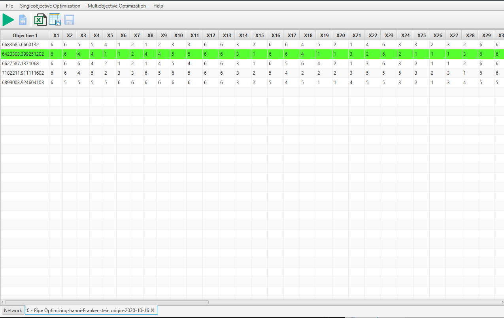
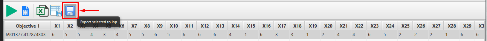
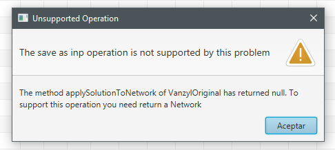
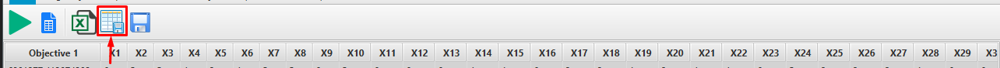

== Funcionalidades de la aplicación

=== Cargar una red

Ve a menu:File[Open] , como se muentra en la imagen a continuación.

image::images/funcionalidades/cargar_red/file.png[]

Busca el directorio donde se encuentre el archivo de configuración de red (Archivo con extensión <file>.inp, *puede ser creado utilizando el programa EPANET versión en ingles* ).

image::images/funcionalidades/cargar_red/seleccionar_red.png[]

Una vez seleccionado el archivo la red ya debe poder visualizarse en la ventana de la aplicación. La siguiente imagen muestra la ventana de selección.

image::images/funcionalidades/cargar_red/visualizar_red.png[]

''' 

=== Visualizar las características de los elementos de la red

Hay dos formas para visualizar la características de los elementos de la red. 

Estas son:

. Hacer *doble click derecho*, en el gráfico, sobre el elemento de la red que quiere visualizar. En la siguiente imagen se muestra la interfaz que es abierta por esta función, la flecha indica donde se ha realizado ha pulsado.
+
image::images/funcionalidades/visualizar_caracteristicas/doble_click_grafico.png[]

. Hacer *doble click derecho* desde el visor de elementos. En la siguiente imagen se puede este visor y que se ha abierto la interfaz para ver los detalles de los elementos.
+
image::images/funcionalidades/visualizar_caracteristicas/lista_de_elementos.png[]

Al hacer *click derecho* sobre un elemento, ya sea desde el gráfico o desde el visor, el elemento seleccionado sera índicado con un círculo de color rojo, como lo muesta la siguiente imagen.

image::images/funcionalidades/visualizar_caracteristicas/click_derecho.png[align=center]

Si la ventana con la información del elemento de la red esta abierta, ésta sera actualizada al nuevo elemento seleccionado.

''' 

=== Realizar una simulación utilizando los valores por defecto del archivo de configuración de red

Para realizar una simulación utilizando los valores que vienen en el archivo de red debe presionar sobre el boton de ejecución. En la siguiuente imagen este boton se puede visualizar bordeado por un cuadro rojo.

image::images/funcionalidades/realizar_simulacion/ejecutar.png[]

Una vez presionado el boton de ejecución se activara el boton de reporte mostrado a su lado. Al presionar sobre este boton se abrira la interfaz de reporte para ver los resultados de la simulación. En la siguiente imagen puede ver que el boton se ha activado y la interfaz utilizada para presentar los resultados cuando la red solo tiene un periodo de simulación.

image::images/funcionalidades/realizar_simulacion/activacion_de_reporte.png[]

Desde la interfaz puede indicar sobre que elemento quiere obtener el reporte. Éste puede ser generados para nodos los enlaces.

image::images/funcionalidades/realizar_simulacion/ventana_resultados_un_periodo.png[]

Una vez seleccionado lo que se quiere mostrar y pulsar el boton OK se muestran los datos como en la siguiente imagen.

image::images/funcionalidades/realizar_simulacion/ventana_resultados_un_periodo_reporte.png[]

En el caso de que la red realice una simulación por periodo de tiempo prolongado (simule más de un periodo) la interfaz visualizada permite indicar la hora del reporte a obtener o mostrar una serie de tiempo para un elemento específico de la red.

Para mostrar la serie de tiempo de un elemento específico de la red debe seleccionar si este es un nodo o un enlace y posteriormente hacer click sobre el elemento a reportar. Como se puede ver en la siguiente imagen.

image::images/funcionalidades/realizar_simulacion/ventana_resultados_multiples_periodos_reporte.png[]

''' 

=== Ejecutar un algoritmo de optimización

La aplicación cuenta con algunos problemas ya implementados siendo necesario solamente cargar la red y indicar el problema a abordar. Para esto debe buscar el problema que quiere resolver en el menu de la aplicación. Si el problema que quiere resolver no está implementado y tiene conocimientos en programación en el lenguaje Java puede implementarlo usted mismo como se muestra en <<Como agregar nuevos problemas>>. La siguiente imagen muestra los menús donde están los problemas.

image::images/funcionalidades/ejecutar_algoritmo_optimizacion/menu_problemas.png[]

Como se puede observar de la imagen anterior, los problemas son divididos en dos menús, dependiendo del enfoque con el que fueron resueltos. Al momento de seleccionar el problema que se quiere abordar se abre una ventana de configuración del experimento. Desde esta ventana se puede ver el nombre del algoritmo utilizado para resolver el problema, el problema abordado, y una descripción de éste.

image::images/funcionalidades/ejecutar_algoritmo_optimizacion/ventana_de_configuracion_descripcion.png[]

En la segunda pestaña "_Configuration_" se puede configurar los parámetros utilizados para configurar el experimento, algoritmos, operadores y problemas. Ésto se muestra en la siguiente imagen.

image::images/funcionalidades/ejecutar_algoritmo_optimizacion/ventana_de_configuracion.png[]

Al configurar los parametros y pulsar el boton "_Run_" se ejecutara el experimento, si no hubo ningun error durante su creación. Adicionalmente, se abre una ventana en que se muestra el estado de la ejecución del experimento.

Para el caso monoobjetivo esta ventana es la que se muestra a continuación.

image::images/funcionalidades/ejecutar_algoritmo_optimizacion/ventana_de_estado_ejecucion_monoobjetivo.png[]

Desde esta ventana se puede ver la información del algoritmo que esta siendo ejecutado, el con el que se esta trabajando y el número de repeticiones a ejecutar del algoritmo, asi como detalles de la ejecución de éste último.

Para el caso multiobjetivo la ventana es la siguiente:

image::images/funcionalidades/ejecutar_algoritmo_optimizacion/ventana_de_estado_ejecucion_multiobjetivo.png[]

En esta ventana se muestra lo mismo que lo anteriormente mencionadado para el caso monoobjetivo. Pero adicionalmente, se muestra un cuadro de texto extra en la que se registra los accesos que se hacen al disco. Esto se debe a que en los experimentos para los algoritmos multiobjetivos, se almacena los resultados generados durante la ejecución en una carpeta temporal.

==== Ver gráfico de las soluciones
Desde la ventana de estado de la ejecución, para aquellos experimentos formados por algoritmo de 1 o 2 objetivos se puede visualizar el gráfico de las soluciones, si es que está activado en el menú de la aplicación.

Para los experimentos de algoritmos monoobjetivo, el gráfico es realizado utilizando en el eje X el numero de las iteraciones y en el eje Y el valor objetivo a optimizar. A cada una de las repeticiones del algoritmo configurada en el experimento se le asigna un color, de entre una paleta de colores pre-establecida (paleta de 20 colores, si hay más de 20 repeticiones del un algoritmo se empezaran a repetir los colores). Cada uno de los puntos corresponde al resultado de una iteración del algoritmo en ejecución. En la siguiente imagen se puede apreciar el gráfico para un problema monoobjetivo.

image::images/funcionalidades/ejecutar_algoritmo_optimizacion/grafico_de_resultados_monoobjetivo.png[]

En cuanto a los experimentos con algoritmos multiobjetivos, como se menciono anteriormente, con dos objetivos. El eje X corresponde al valor del primer objetivo, mientras que en el eje Y se tiene el valor del segundo objetivo. En este caso, cada color corresponde a las soluciones de la Frontera de Pareto de cada una de las repeticiones del algoritmo. A continuación se muestra el gráfico para un experimento con un algoritmo multiobjetivo.

image::images/funcionalidades/ejecutar_algoritmo_optimizacion/grafico_de_resultados_multiobjetivo.png[]

==== Exportar como imagen el gráfico de las soluciones

Desde la pestaña del gráfico se puede guardar este en formato png. El archivo guardado corresponde a una _snapshot_ del gráfico por lo que el tamaño de la pantalla influye en el tamaño del archivo guardado. La siguiente imagen indica con una flecha roja el boton de guardado.

image::images/funcionalidades/ejecutar_algoritmo_optimizacion/grafico_de_resultados_boton.png[]

==== Visualizar los resultados

Una vez terminada la ejecución del experimento se abre en la interfaz principal una pestaña con los resultados de éste. En el caso de los experimentos utilizando algoritmos monoobjetivos, la pestaña contiene la misma cantidad de resultados que el número de repeticiones del algoritmo configurado. Cada una de estas soluciones corresponde a la mejor solución de cada una de las repeticiones y de entre ellas la mejor es marcada con el color verde como se muestra a continuación.

Por otro lado, para los experimentos multiobjetivos, al momento de finalizar la ejecución del experimento, de las soluciones de cada una de las repeticiones del algoritmo utilizado (Cada solución tiene su propia frontera de pareto en los algoritmos multiobjetivos), se obtiene la *Frontera de Pareto* final resultante (De las fronteras de los diversos algoritmos multiobjetivos ejecutados se combinan las soluciones en un solo conjunto y se obtiene la frontera de éste).

image::images/funcionalidades/ejecutar_algoritmo_optimizacion/pestania_resultados_multiobjetivo.png[]

==== Guardar los resultados

Una vez terminada la ejecución de los experimentos, ya sean monoobjetivo o multiobjetivo, desde la pestaña abierta con las soluciones se pueden guardar los resultados de la optimización en diversos formatos. Estos son, un excel, un par de archivos de texto (csv) o seleccionar una solución y aplicarla sobre una red generando como resultado un archivo de configuración.

Para aplicar los resultados a una red y guardarla como un *archivo de configuración* (archivo extensión .inp), se debe seleccionar una solución y posteriormente pulsar el boton de guardado como se muestra en la imagen a continuación.

Esto genera como resultado un nuevo archivo de configuración, en que de acuerdo a los valores de la solución se remplazan los que originalmente tenía el archivo. A continuación se muestran los cambios en el archivo inp, para el problema de optimización de las tuberías (Pipe Optimizing) al guardarlos utilizando esta función.

[source.to_long,java]
.Valores originales en archivo inp
----
[PIPES]
;ID              	Node1           	Node2           	Length      	Diameter    	Roughness   	MinorLoss   	Status
 Linea_1         	P1              	N2              	100         	1016         	130         	0           	Open  	;
 Linea_10        	N10             	N11             	950         	1016        	130         	0           	Open  	;
 Linea_11        	N11             	N12             	1200        	1016 	        130         	0           	Open  	;
 Linea_12        	N12             	N13             	3500        	1016         	130         	0           	Open  	;
 Linea_13        	N10             	N14             	800         	1016         	130         	0           	Open  	;
 Linea_14        	N14             	N15             	500         	1016        	130         	0           	Open  	;
 Linea_15        	N15             	N16             	550         	1016            130         	0           	Open  	;
 Linea_16        	N16             	N17             	2730        	1016        	130         	0           	Open  	;
 Linea_17        	N17             	N18             	1750        	1016          	130         	0           	Open  	;
 Linea_18        	N18             	N19             	800         	1016         	130         	0           	Open  	;
 Linea_19        	N19             	N3              	400         	1016         	130         	0           	Open  	;
 Linea_2         	N2              	N3              	1350        	1016        	130         	0           	Open  	;
 Linea_20        	N3              	N20             	2200        	1016          	130         	0           	Open  	;
 Linea_21        	N20             	N21             	1500        	1016        	130         	0           	Open  	;
 Linea_22        	N21             	N22             	500         	1016         	130         	0           	Open  	;
 Linea_23        	N20             	N23             	2650        	1016       		130         	0           	Open  	;
 Linea_24        	N23             	N24             	1230        	1016        	130         	0           	Open  	;
 Linea_25        	N24             	N25             	1300        	1016         	130         	0           	Open  	;
 Linea_26        	N25             	N26             	850         	1016        	130         	0           	Open  	;
 Linea_27        	N26             	N27             	300         	1016         	130         	0           	Open  	;
 Linea_28        	N27             	N16             	750         	1016        	130         	0           	Open  	;
 Linea_29        	N23             	N28             	1500        	1016        	130         	0           	Open  	;
 Linea_3         	N3              	N4              	900         	1016          	130         	0           	Open  	;
 Linea_30        	N28             	N29             	2000        	1016          	130         	0           	Open  	;
 Linea_31        	N29             	N30             	1600        	1016         	130         	0           	Open  	;
 Linea_32        	N30             	N31             	150         	1016         	130         	0           	Open  	;
 Linea_33        	N31             	N32             	860         	1016         	130         	0           	Open  	;
 Linea_34        	N32             	N25             	950         	1016         	130         	0           	Open  	;
 Linea_4         	N4              	N5              	1150        	1016          	130         	0           	Open  	;
 Linea_5         	N5              	N6              	1450        	1016       		130         	0           	Open  	;
 Linea_6         	N6              	N7              	450         	1016          	130         	0           	Open  	;
 Linea_7         	N7              	N8              	850         	1016        	130         	0           	Open  	;
 Linea_8         	N8              	N9              	850         	1016         	130         	0           	Open  	;
 Linea_9         	N9              	N10             	800         	1016         	130         	0           	Open  	;   
---- 

[source.to_long,java]
.Valores generados por la optimización.
----
[PIPE]
;ID        	Node1     	Node2     	Length    	Diameter  	Roughness 	MinorLoss 	Status    
Linea_1 	P1        	N2        	100.000000	609.600000	130.000000	0.000000  	OPEN      
Linea_10	N10       	N11       	950.000000	1016.000000	130.000000	0.000000  	OPEN      
Linea_11	N11       	N12       	1200.000000	508.000000	130.000000	0.000000  	OPEN      
Linea_12	N12       	N13       	3500.000000	304.800000	130.000000	0.000000  	OPEN      
Linea_13	N10       	N14       	800.000000	304.800000	130.000000	0.000000  	OPEN      
Linea_14	N14       	N15       	500.000000	406.400000	130.000000	0.000000  	OPEN      
Linea_16	N16       	N17       	2730.000000	508.000000	130.000000	0.000000  	OPEN      
Linea_15	N15       	N16       	550.000000	508.000000	130.000000	0.000000  	OPEN      
Linea_17	N17       	N18       	1750.000000	609.600000	130.000000	0.000000  	OPEN      
Linea_18	N18       	N19       	800.000000	1016.000000	130.000000	0.000000  	OPEN      
Linea_19	N19       	N3        	400.000000	762.000000	130.000000	0.000000  	OPEN      
Linea_2 	N2        	N3        	1350.000000	1016.000000	130.000000	0.000000  	OPEN      
Linea_20	N3        	N20       	2200.000000	508.000000	130.000000	0.000000  	OPEN      
Linea_21	N20       	N21       	1500.000000	304.800000	130.000000	0.000000  	OPEN      
Linea_22	N21       	N22       	500.000000	508.000000	130.000000	0.000000  	OPEN      
Linea_23	N20       	N23       	2650.000000	762.000000	130.000000	0.000000  	OPEN      
Linea_24	N23       	N24       	1230.000000	609.600000	130.000000	0.000000  	OPEN      
Linea_25	N24       	N25       	1300.000000	762.000000	130.000000	0.000000  	OPEN      
Linea_26	N25       	N26       	850.000000	304.800000	130.000000	0.000000  	OPEN      
Linea_27	N26       	N27       	300.000000	406.400000	130.000000	0.000000  	OPEN      
Linea_28	N27       	N16       	750.000000	762.000000	130.000000	0.000000  	OPEN      
Linea_29	N23       	N28       	1500.000000	1016.000000	130.000000	0.000000  	OPEN      
Linea_3 	N3        	N4        	900.000000	1016.000000	130.000000	0.000000  	OPEN      
Linea_30	N28       	N29       	2000.000000	1016.000000	130.000000	0.000000  	OPEN      
Linea_31	N29       	N30       	1600.000000	304.800000	130.000000	0.000000  	OPEN      
Linea_32	N30       	N31       	150.000000	406.400000	130.000000	0.000000  	OPEN      
Linea_33	N31       	N32       	860.000000	1016.000000	130.000000	0.000000  	OPEN      
Linea_34	N32       	N25       	950.000000	406.400000	130.000000	0.000000  	OPEN      
Linea_4 	N4        	N5        	1150.000000	304.800000	130.000000	0.000000  	OPEN      
Linea_5 	N5        	N6        	1450.000000	508.000000	130.000000	0.000000  	OPEN      
Linea_6 	N6        	N7        	450.000000	1016.000000	130.000000	0.000000  	OPEN      
Linea_7 	N7        	N8        	850.000000	1016.000000	130.000000	0.000000  	OPEN      
Linea_9 	N9        	N10       	800.000000	762.000000	130.000000	0.000000  	OPEN      
Linea_8 	N8        	N9        	850.000000	1016.000000	130.000000	0.000000  	OPEN    
---- 

Como se menciona en <<Como agregar nuevos problemas>> el método _applySolutionToNetwork_ debe estar implementado en la clase del problema. En el caso de que el método no este implementado la aplicación mostrara el siguiente mensaje de error.

Para guardar los resultados como una *tabla de excel* se debe pulsar el boton asociado con la función de guardado, dicho boton se puede apreciar en la siguiente imagen. Al ser presionado ese boton se guardará toda la tabla.

image::images/funcionalidades/ejecutar_algoritmo_optimizacion/guardar_excel.png[]

Se pueden *exportar las soluciones a un archivo de texto*. Dicho archivo tendran la extensión csv. Al usar esta función se generan dos archivos, uno tiene el prefijo FUN_ y el otro el prefijo VAR_. Por ejemplo, FUN_resultado.csv y VAR_resultado.csv. El archivo FUN almacena el valor de los objetivos de los resultados, mientras que el archivo VAR contiene las variables utilizadas para alcanzar dicho objetivo. La siguiente imagen indica el boton utilizado para guardar como archivo de texto.

'''

=== Realizar comparación de algoritmos multiobjetivos.
Para comparar algoritmos multiobjetivos se debe cargar la red e ir al menu:Indicators[Compare multiobjective experiments] como se muestra a continuación.

image:images\funcionalidades\indicadores\menu_indicadores.png[]

Despues hay que seleccionar los indicadores que se quieren utilizar para la comparación. A continuación se muestra la interfaz para la selección. 

image:images\funcionalidades\indicadores\eleccion_indicadores.png[]

Una vez escogidos los indicadores hay que escoger los problemas que quieren ser utilizados y la cantidad de instancias de cada uno de ellos. Junto con los problemas, hay que escoger los algoritmos a evaluar. La siguiente imagen muestra esta interfaz.

image:images\funcionalidades\indicadores\eleccion_experimentos.png[]

[CAUTION]
====
Si especifica que quiere realizar la comparación de los indicadores para más de un problema a la vez. Los algoritmos que configure para cada problema deben ser los mismos.

Por ejemplo lo mostrado en la siguiente imagen no es valido, puesto que para el problema _Pumping Scheduling_ se configuro el algoritmo NSGAII y SMPSOInteger, mientras que para el otro problema solo se configura NSGAII.

image:images\funcionalidades\indicadores\configuracion_invalida.png[]

Pero lo siguiente si, ya que los dos problemas tienen configurados los mismos algoritmos.

image:images\funcionalidades\indicadores\configuracion_valida.png[]

Deben haber más de dos algoritmos seleccionados, puedo que esto es necesario para contruir la tabla de Wilcoxon, la cual pide un par de algoritmos. Estos algoritmos pueden ser dos del mismo tipo o dos de diferentes tipo. 

Por ejemplo, las configuración mostrada en la siguiente imagen es valida en los dos casos.

image:images\funcionalidades\indicadores\configuracion_valida_algoritmo.png[]
====

De acuerdo a la cantidad de instancias de cada problema y la cantidad de algoritmos se crea la interfaz para configurar los experimentos. Por cada instancia de un problema se tiene la cantidad de algoritmos configuradas. Por ejemplo, si se configuran dos instancias del problema _Pumping Scheduling_; y se establece 2 instancias del algoritmo _NSGAII_ y 2 instancias del algoritmo _SMPSO_ se generara la interfaz de la siguiente imagen.

image:images\funcionalidades\indicadores\configuracion_experimentos.png[]

En esta interfaz, cada algoritmo con el mismo nombre se considera como el mismo y deben ser configurados de la misma manera. Por ejemplo, del problema _Pumping Scheduling - 0_ y del problema _Pumping Scheduling - 1_ el algoritmo _NSGAII_ de cada uno de ellos debe ser configurado de la misma manera, puesto que son considerados iguales.

CAUTION: Asegurese todos los experimentos configurados, no importa para el problema que sean, tengan el mismo número de ejecuciones independientes. Si éste no es el caso, una excepción puede ser lanzada al momento de intentar visualizar los resultados de la simulación.

Una vez configurado y aceptado los problemas comienza la ejecución del algoritmo mostrando la siguiente interfaz.

image:images\funcionalidades\indicadores\ejecucion_indicadores.png[]

Finalmente, cuando se termina la ejecución del algoritmo se muestra en la interfaz principal una nueva ventana en la que por cada indicador se pueden ver los gráficos de la comparación. A continuación se muestra unas imagenes de como son presentados los resultados.

image:images\funcionalidades\indicadores\resultadofinal.png[]

[NOTE]
====
Puede que necesite guardar los resultados de la comparación, estos resultados se almacenan automaticamente en una carpeta temporal llamada "*temp*" en el directorio en el que se ejecuto la aplicación. El nombre de la carpeta es generado aleatoriamente.

image:images\funcionalidades\indicadores\carpeta_temporal.png[]
====

Para más detalles sobre como funcionan los indicadores pulse <<Como agregar nuevos indicadores>>