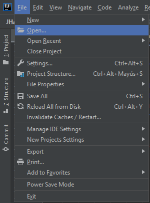
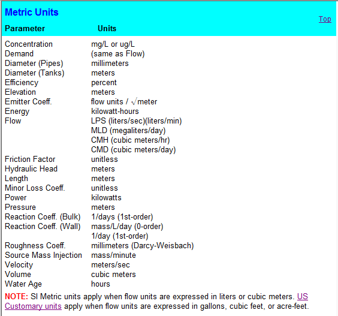

== Introducción al ambiente de JHawanet
=== Que es JHawanetFramework

JHawanetFramework es un software implementado sobre la plataforma Java, que permite la optimización de redes de distribución de agua potable (RDA), incorporando una serie de problemas y algoritmos metaheurísticos. Adicionalmente, brinda al usuario avanzado la capacidad de extender la aplicación agregando nuevos algoritmos, problemas y operadores.

El objetivo de este software es optimizar el diseño y operación de redes de distribución de agua potable, proporcionando dichas capacidades a través de una interfaz gráfica amigable con el usuario. Está basado en la arquitectura lógica del framework multiobjetivo link:https://github.com/jMetal/jMetal[jMetal] implementando una serie de algoritmos metaheurísticos de optimización monoobjetivo y multiobjetivo aplicables en problemas de RDA.

Junto a lo anteriormente mencionado, JHawanetFramework permite realizar simulaciones hidráulicas utilizando las configuraciones que vienen en el archivo de configuración de red y ver la configuración de los elementos que conforman la red. El archivo de configuración de red se debe encontrar en el formato utilizado por el software link:https://www.epa.gov/water-research/epanet[Epanet] al exportar con la extensión inp.

Al momento de realizar la optimización, este software brinda la capacidad de visualizar gráficamente las soluciones para problemas con uno o dos objetivos. Una vez terminada la simulación, permite exportar las soluciones como un excel o a un conjunto de archivos csv. Adicionalmente, se puede seleccionar una solución para, de acuerdo a esta solución, modificar los valores establecidos por defecto en el archivo de configuración de red, permitiendo guardar este archivo en el sistema para poder ser usado con el software link:https://www.epa.gov/water-research/epanet[Epanet] u otros que acepten el formato inp.

JHawanetFramework surge como parte del proyecto Fondecyt Regular N° 1180660 ``Optimization of real-world water distribution systems and hydraulic elements using computational fluid dynamics (cfd) and evolutionary algorithms.'', 2018.

=== Tipos de usuarios

Se contemplan dos tipos de usuarios:

*   Usuarios que trabajan directamente con la aplicación gráfica.
*   Usuarios que utilizan la estructura para acoplar nuevos problemas desde el punto de vista computacional.

////
=== Objetivo

Este software fue creado con el objetivo de optimizar el diseño y operación de redes de distribución de agua potable, proporcionando dichas capacidades a través de una interfaz gráfica amigable con el usuario. Está basado en la arquitectura lógica del framework multiobjetivo jMetal implementando una serie de algoritmos metaheurísticos de optimización monoobjetivo y multiobjetivo aplicables en problemas de RDA.

////

=== Capacidades actuales del programa

El sistema en este momento cuenta con las siguientes capacidades:

* Cargar y visualizar la configuración de los elementos de la red.
* Ejecutar la simulación de la red utilizando los valores por defecto que vienen en el archivo de configuración de ésta.
* Ejecutar algoritmos de optimización monoobjetivos y multiobjetivos para los problemas implementados.
* Visualizar el gráfico de las soluciones para problemas de uno y dos objetivos.
* Visualizar los resultados de algoritmos de optimización.
* Exportar los resultados de la optimización a excel y csv.
* Remplazar en la red cargada los valores de la solución para generar un nuevo archivo de configuración de red.
* Comparar algoritmos metaheurísticos multiobjetivos utilizando indicadores y guardar los resultados en diversos formatos.

=== Especificaciones técnicas del sistema

El software fue desarrollado bajo el lenguaje de programación Java, utilizando la libreria JavaFX para la creación de la interfaz gráfica. Adicionalente, se hace uso de la librería dinámica link:https://www.epa.gov/water-research/epanet[EpanetToolkit] para realizar las simulaciones hidráulicas sobre las redes de agua potable y evaluar las soluciones generadas por los algoritmos metaheurísticos.

Los algoritmos metaheurísticos implementados, estan basados en aquellos utilizados en la librería link:https://github.com/jMetal/jMetal[jMetal], especificamente la versión 5.9, pero no se hace uso de este framework.

Para poder ejecutar la aplicación se tienen los siguientes requisitos:

* Windows 64 bits
* JDK 1.8 64 bits
* Maven
* link:https://www.epa.gov/water-research/epanet[EpanetToolkit 2.0]

=== Como instalar el software
Para instalar la aplicación se necesita tener instalado en el sistema Java 1.8 64bits y Maven. El código de la aplicación se encuentra alojado en github en el siguiente link:https://github.com/EinherjarSt/ProyectoDeMemoria[repositorio]. A continuación se explica como instalar cada uno de estos elementos.

==== Como instalar Java
Para instalar java vaya al siguiente link:https://www.oracle.com/cl/java/technologies/javase/javase-jdk8-downloads.html[enlace]. Una vez en el enlace descargue el la versión de java para Window x64 como se muestra en la siguiente imagen.

image:images\instalacion\instalar_java\descargar_java.png[]

NOTE: Al intentar descargar Java le solicitará que ingrese una cuenta de oracle. Si no la tiene debe crearsela e intentar nuevamente descargarlo.

Una vez descargado el instalador de java, ejecutelo y siga los pasos del instalador. Durante la instalación, le indicará la ruta en que se instalara el programa. Esta ruta debe recordarla para realizar los siguientes pasos. En la siguiente imagen se muestra la ruta.

image:images\instalacion\instalar_java\instalando_java.png[]

Una vez finalizada la instalación debe ir a las variables del sistema. Para ello busque la carpeta *Este Equipo*, click derecho y propiedades; luego en configuración del sistema y finalmente en variables de entorn, como se ve a continuación.

image:images\instalacion\instalar_java\abrir_variables_entorno.png[]

[NOTE] 
====
Tambien puede usar la barra de busquedas del sistema Window.

image:images\instalacion\instalar_java\buscar_variable.png[]
====

Busque entre las variables de entorno, las variables *PATH* y *JAVA_HOME*. Si no existe tendrá que crearlas. Puede crearlas como variable de entorno del usuario o del sistema. La variable *JAVA_HOME* tiene que contener la ruta al jdk previamente instalado, como se muestra a continuación.

image:images\instalacion\instalar_java\JAVA_HOME.png[]

En la variable PATH, debemos agregar la ruta a los ejecutables de java. Ésto permitira que java pueda ser ejecutado desde una terminal. Para ello agregamos lo siguiente en dicha variable.

----
%JAVA_HOME%\bin
----

A continuación se muestra como debe quedar la variable *PATH*.

image:images\instalacion\instalar_java\path_java.png[]

[WARNING]
====
En las variable de entorno *PATH*, ya sea del usuario o del sistema, pueden aparecer otras referencias a los ejecutables de java que son instaladas por defecto en el sistema. Estas referencias deben ser borradas. Si no son borradas, el sistema utilizará estas referencia en vez de la instalada por nosotros. A continuación se muestra una imagen con el nombre de esta referencia.

image:images\instalacion\instalar_java\path_java_remove.png[]
====

Una vez hecho todo lo anteriormente mencionado, guarde los cambios pulsando el boton btn:[Aceptar].

Para comprobar que la instalación fue exitosa abra la terminal del sistema, ya sea CMD o PowerShell y escriba el siguiente línea.

----
java -version
----

la anterior línea debe mostrar un resultado parecido al siguiente, la subversión de Java puede ser diferente.

image:images\instalacion\instalar_java\probando_java.png[]

==== Como instalar Maven
Para instalar maven vaya al siguiente link:https://maven.apache.org/download.cgi[link] y descargue el archivo que se muestra en la imagen a continuación.

image:images\instalacion\instalar_maven\descargar_maven.png[]

Una vez descargado maven, descomprimalo. Con maven descargado y descomprimido debe agregarlo a la variable de entorno *PATH* como se muestra a continuación.

image:images\instalacion\instalar_maven\path_maven.png[]

Cuando tenga configurada la variable *PATH* con maven compruebe que la instalación fue correcta ingresando el siguiente comando.

----
mvn -version
----

A continuación se muestra la salida del comando.

image:images\instalacion\instalar_maven\probando_mvn.png[]

Una vez maven este instalado, hay que agregar el jar de la EpanetToolkit, requerido para la simulación, al repositorio de maven como una librería. Para esto ejecute el siguiente comando:

----
mvn install:install-file -Dfile="lib/epajava.jar" -DgroupId=epajava -DartifactId=epajava -Dversion="1.0" -Dpackaging=jar
----

===== Como ejecutar la aplicación

Para compilar la aplicación primero hay que compilarla. Para esto puede generar un archivo jar con el siguiente comando.

----
mvn clean jfx:jar
----

La salida de este comando se encuentra en el directorio target/jfx y contiene la librería, el ejecutable y la dll. Esta salida se muestra en la imagen a continuación.

image:images\instalacion\ejecutar\jar.png[]

La salida del comando mencionada anteriormente puede ser compartida y para su ejecución únicamente se requiere tener instalado Java 1.8 64bits.

A continuación se presenta otra manera de compilar y ejecutar la aplicación. Esta consiste en ejecutar el siguiente comando.
----
mvn jfx:native
----

Esto genera una aplicación autocontenida, que no requiere la instalación de ningun programa externo, ya que incluye tanto las librerías del proyecto, así como una copia del jre de java. A continuación se muestra la salida del comando anterior.

image:images\instalacion\ejecutar\exe.png[]

==== Abrir proyecto con eclipse
Abrir el proyecto desde eclipse y agregar la ruta lib/additionalResources y la carpeta src/resource, en caso de que no se encuentre, al *build path*. Para ello, seleccione la carpeta y muestre el menú contextual. Luego, en la opción *Build path* seleccione la opción *Use as source folder* (Puede cambiar la configuración también desde *Configure build path*). Esto se muestra en la imagen a continuación:

image::images/instalacion/jhawanet/addPath.png[]

El *build path* debería mostrarse de la siguiente manera:

image::images/instalacion/jhawanet/BuildPath.png[]

Tambien hay que comprobar la instalación del jdk, ya que por eclipse a veces usa la version de java incorporada en el IDE. Como se muestra a continuación.

image:images\instalacion\jhawanet\eclipse_propierties_default-java.png[]

Para cambiar la versión de java utilizada, selecciona la librería y presiona el btn:[Remove]. Posteriormente, presiona btn:[Add library], seleccióna "_JRE System Library_" y posteriormente btn:[Next] como se muestra a continuación.

image:images\instalacion\jhawanet\eclipse_propierties_configure.png[]

En la siguiente ventana selecciona "_Alternate JRE_" y pulsa btn:[Installed JRE], tal como se ve en la siguiente imagen.

image:images\instalacion\jhawanet\eclipse_propierties_configure2.png[]

Posteriormente, ve a "_Installed JRE_" y pulsa btn:[Add...]. En la ventana que se abre, selecciona "_Standard VM_". Estos pasos se pueden ver en la siguiente imagen.

image:images\instalacion\jhawanet\eclipse_propierties_configure3.png[]

Luego, busca en el sistema la versión de java enteriormente instalada como se muestra a continuación y guarda los cambios.

image:images\instalacion\jhawanet\eclipse_propierties_configure4.png[]

Con los cambios guardados selecciona el JDK anteriormente agregado como el por defecto de eclipse como se muestra a continuación.
image:images\instalacion\jhawanet\eclipse_propierties_configure5.png[]

Finalmente, debes establecer el JDK instalado, como el que va a ser usado para ejecutar tu proyecto. La siguiente imagen muestra esto último.

image:images\instalacion\jhawanet\eclipse_propierties_configure6.png[]

==== Abrir Proyecto en IntelliJ
Abrir o exportar la carpeta del proyecto en IntelliJ. Para esto hay dos formas de hacerlo. La primera consiste en hacerlo desde la ventana de bienvenida usando la opción btn:[Open or import] como se muestra a continuación.

image::images/instalacion/jhawanet/WelcomeViewIJ.png[]

o desde un proyecto ya abierto ir a menu:File[Open].

Una vez abierto el proyecto hay que revisar si las carpetas están correctamente configuradas. Para ello, es necesario agregar la carpeta lib/additionalResources y la carpeta src/resource en la configuración de la estructura del proyecto en caso de que no se encuentren ya agregadas. Para configurar la estructura del proyecto ve a menu:File[Proyect Structure].

image::images/instalacion/jhawanet/ProyectStructureMenu.png[]

y en btn:[Modules] revisa que esté de la siguiente manera:

image::images/instalacion/jhawanet/ProyectStructure.png[]

en caso de que no se encuentre la configuración de la manera indicada busca la carpeta deseada y seleccionala. Luego, has click sobre el botón btn:[Resources].

image::images/instalacion/jhawanet/ProyectStructureAddResource.png[]

Finalmente, comprueba que la versión de Java utilizada para compilar y el lenguaje utilizado sea la versión 1.8 de 64bits como se muestra a continuación.

image::images\instalacion\jhawanet\ProyectStructure_sdk.png[]

con esto el proyecto estará listo para ser usado en IntelliJ. 

IMPORTANT: La version en ingles y la version en español de epanet a veces ocupan distintas palabras claves (Ej: Feet en ingles y Pies en español). Este programa lee el formato inp de la version en ingles.
NOTE: La ventaja de usar IntelliJ es que este posee un analizador de código que en mi opinión es bastante util y permite detectar el uso de algunas anotaciones extras para verificar el codigo como @NotNull y @Nullable. En caso de que el proyecto sea abierto usando eclipse estas anotaciones no tienen uso pero no causaran problemas en la compilación del proyecto.

[CAUTION]
====
Dependiendo de la unidad de flujo (*Flow*) escogida, el sistema de unidades cambia. Para más información ver en el manual de epanet la sección *Units of Measurement*. A continuación también se adjuntas unas imagenes referentes a esto:

image::images/instalacion/jhawanet/USUnits.png[]
====

CAUTION: Se debe tener cuidado con el *encoding* de los archivos. Por defecto, el programa lee y escribe en ISO-8859-1. Pero para evitar cualquier error, mejor asegurar que los archivos de red no contengan caracteres raros como ´,ñ, etc.

NOTE: Si se agrega el atributo *OverallConstraintViolation* para penalizar las soluciones, este atributo sera recuperado y mostrado en la ventana de resultados.

[CAUTION]
.Para desarrolladores principalmente
====

Tener cuidado con cerrar epanet (epanet.ENclose). Si está cerrado hacer una llamada a la librería puede causar que el programa se cierre y no lanzara ninguna advertencia más que un código de error. 
====